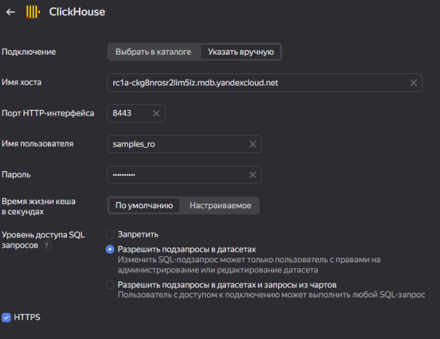
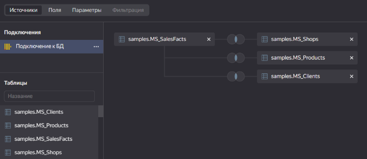
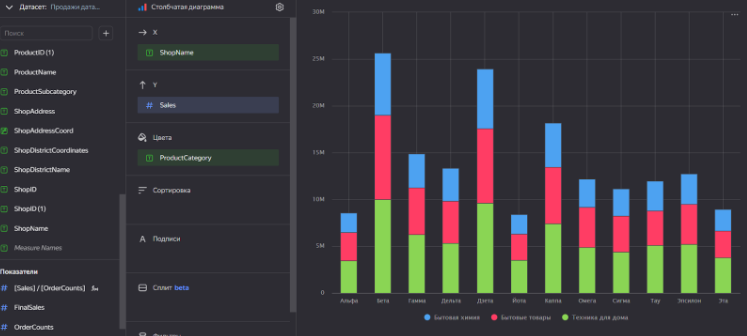
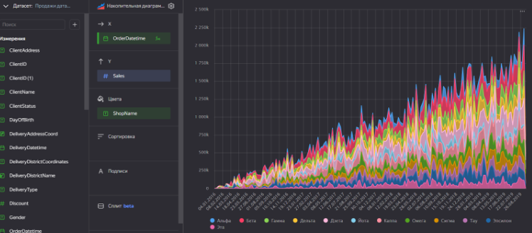
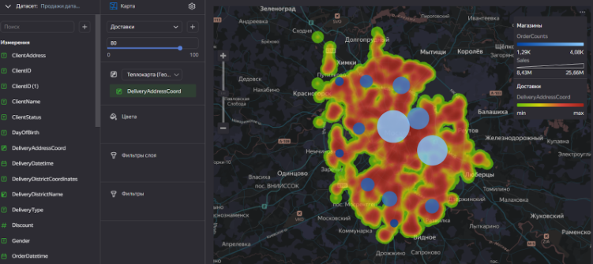
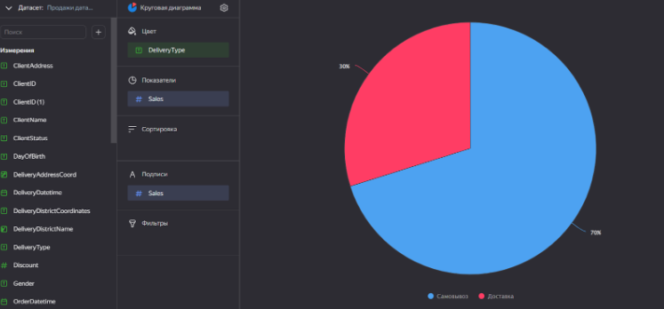
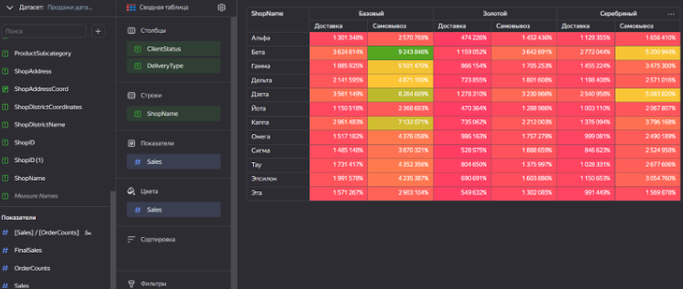
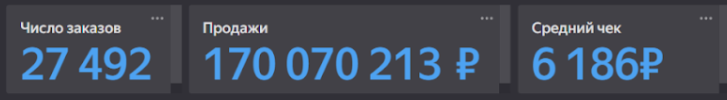
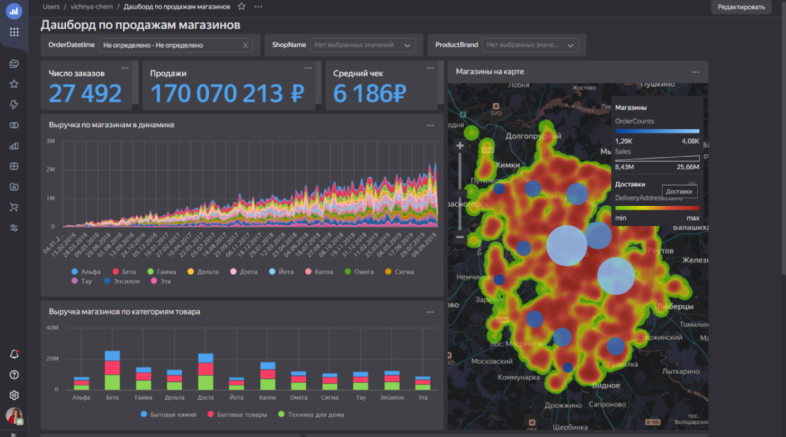
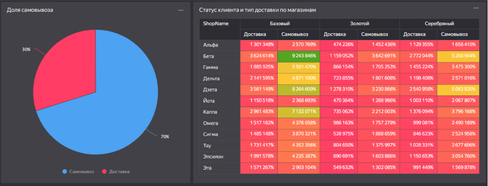

## Лабораторная работа 1. Знакомство с Yandex DataLens. Простые чарты и дашборды
>[Портфолио](/lr/port.md)

>[Отчет по работе](https://drive.google.com/file/d/1rnoHLVFGoUcuQdWhRGofoVWXT_ccBMHi/view?usp=drive_link)
> 
> [Ссылка на конечный дашборд](https://datalens.yandex/pesw5fnb0vrqf)

Задание: Зарегестрироваться в Yandex DataLens. Подключиться к базе данных с знаниями о продажах.  Описать логику работы с датасетом. Создать несколько чартов и дашбордов на основе данных.

Подключение к базе данных:⠀⠀⠀⠀⠀⠀⠀⠀⠀⠀⠀⠀⠀⠀⠀⠀⠀⠀⠀⠀⠀⠀⠀⠀⠀⠀⠀⠀⠀⠀⠀⠀⠀⠀⠀⠀⠀⠀⠀⠀⠀⠀⠀

Логика работы с датасетом:⠀⠀⠀⠀⠀⠀⠀⠀⠀⠀⠀⠀⠀⠀⠀⠀⠀⠀⠀⠀⠀⠀⠀⠀⠀⠀⠀⠀⠀⠀⠀⠀⠀⠀⠀⠀⠀⠀⠀⠀⠀⠀⠀

Чарты:
* Выручка магазинов по категориям
 
* Выручка по магазинам в динамике

* Магазины на карте⠀⠀⠀⠀⠀⠀⠀⠀⠀⠀⠀⠀⠀⠀⠀⠀⠀⠀⠀⠀⠀⠀⠀⠀⠀⠀⠀⠀⠀⠀⠀⠀⠀⠀⠀⠀⠀⠀⠀⠀⠀⠀⠀⠀⠀⠀⠀⠀⠀

* Доля самовывоза⠀⠀⠀⠀⠀⠀⠀⠀⠀⠀⠀⠀⠀⠀⠀⠀⠀⠀⠀⠀⠀⠀⠀⠀⠀⠀⠀⠀⠀⠀⠀⠀⠀⠀⠀⠀⠀⠀⠀⠀⠀⠀⠀⠀⠀⠀⠀⠀⠀⠀⠀

* Статус клиента и тип доставки по магазинам

* Число заказов, средний чек и продажи

  
Дашборд:

