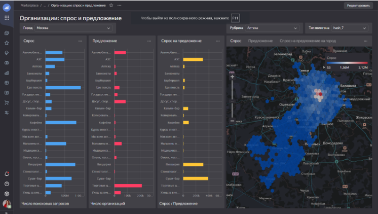
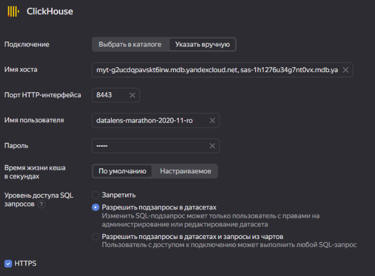
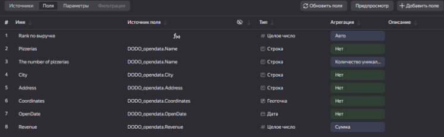
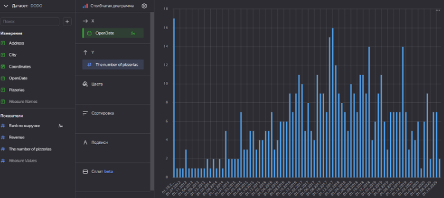
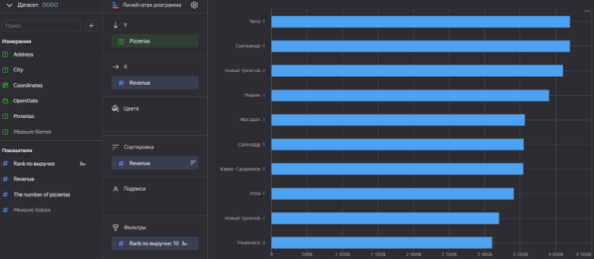
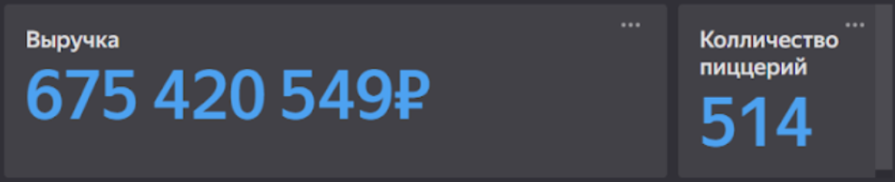
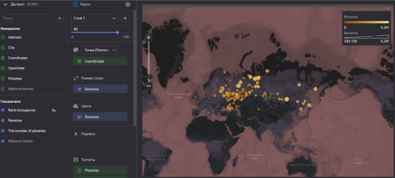
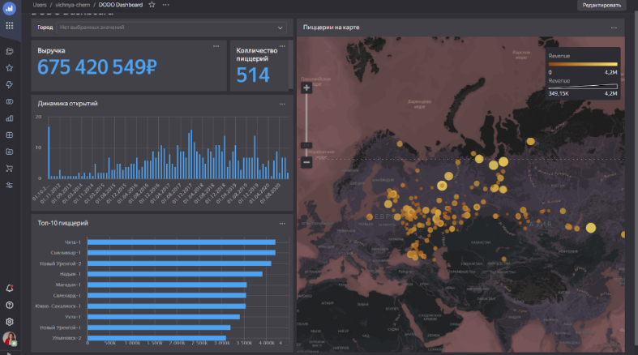
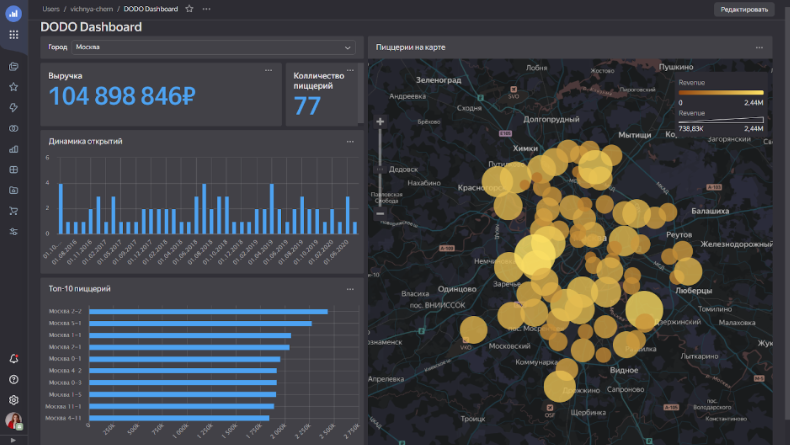

## Лабораторная работа 2. Знакомство с видами чартов в Yandex DataLens
> [Отчет по работе](https://drive.google.com/file/d/1XNZ4rQEr32d35hnbE4kllsZt9TdfzfFt/view?usp=drive_link)
> 
> [Ссылка на конечный дашборд](https://datalens.yandex.ru/xm0hnpyux5x6n-dodo-dashboard)

Задание: Авторизироваться в Yandex DataLens. Подключиться к базе данных с знаниями о сети пиццерий.  Описать логику работы с датасетом. Создать разные виды чартов.

Импорт геослоев из Marketplace:⠀⠀⠀⠀⠀⠀⠀⠀⠀⠀⠀⠀⠀⠀⠀⠀⠀⠀⠀⠀⠀⠀⠀

Подключение к БД:⠀⠀⠀⠀⠀⠀⠀⠀⠀⠀⠀⠀⠀⠀⠀⠀⠀⠀⠀⠀⠀⠀⠀⠀⠀⠀⠀⠀

Настройка полей датасета:⠀⠀⠀⠀⠀⠀⠀⠀⠀⠀⠀⠀⠀⠀⠀⠀

Виды чартов:
* Столбчатая диаграмма:⠀⠀⠀⠀⠀⠀⠀⠀⠀⠀⠀⠀⠀⠀

* Линейчатая диаграмма:⠀⠀⠀⠀⠀⠀⠀⠀⠀⠀⠀⠀⠀

* Индикатор:⠀⠀⠀⠀⠀⠀⠀⠀⠀⠀⠀⠀⠀⠀⠀

* Карта:⠀⠀⠀⠀⠀⠀⠀⠀⠀⠀⠀⠀⠀⠀⠀⠀⠀⠀⠀⠀⠀⠀⠀

Дашборд:⠀⠀⠀⠀⠀⠀⠀⠀⠀⠀⠀⠀⠀⠀⠀⠀⠀⠀

