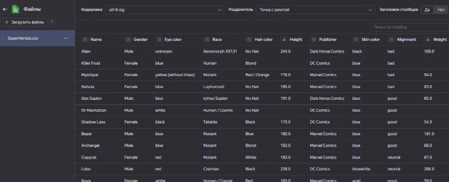
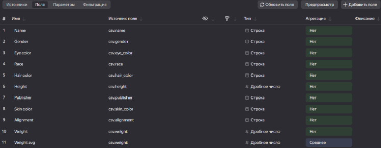
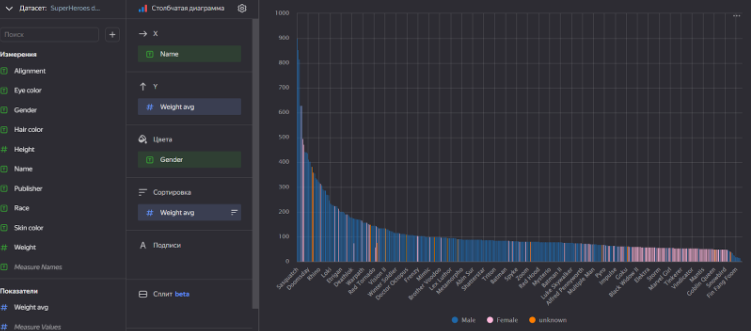
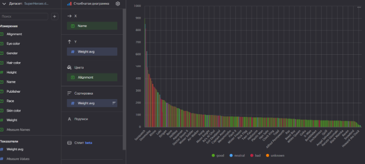
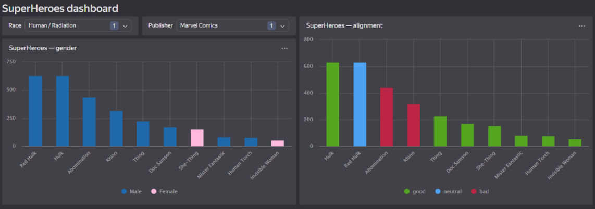

## Лабораторная работа 3. Создание подключения с помощью csv файла. Работа с селекторами
> [Отчет по работе](https://drive.google.com/file/d/1MBRQGFP4uJa02keCLA_yrlTgSPlbZATQ/view?usp=drive_link)
> 
> [Ссылка на конечный дашборд](https://datalens.yandex.ru/0p3o09mga42wq-superheroes-dashboard)

Задание: Авторизироваться в Yandex DataLens. Подключиться к базе данных с помощью csv файла с знаниями о супергероях. Настроить поля датасета. Создать чарты. Добавить селекторы.

Подключение с помощью csv файла:

Настройка полей датасета:

Чарты:
* Пол персонажей:

* Сторона персонажей:

Селекторы:
* Раса
* Издатель

Дашборд с выборкой персонажей расы людей, столкнувшихся с радиацией от издателя marvel comics:

