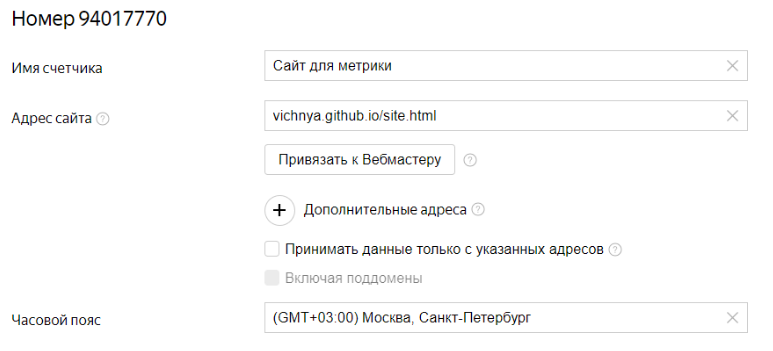
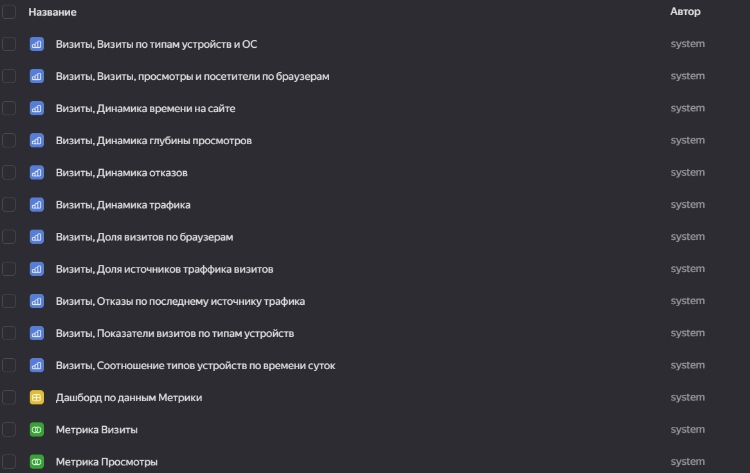
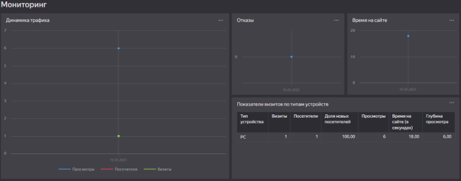
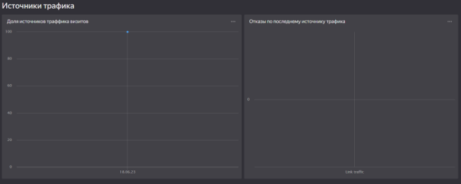
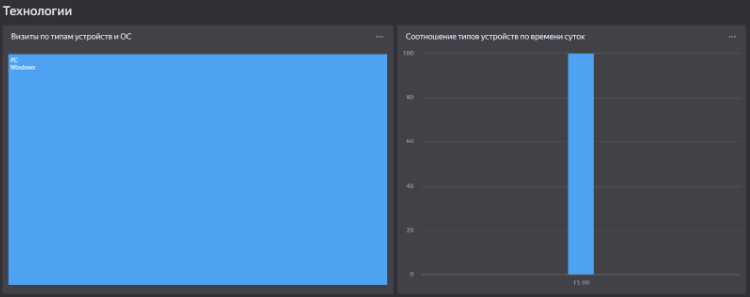
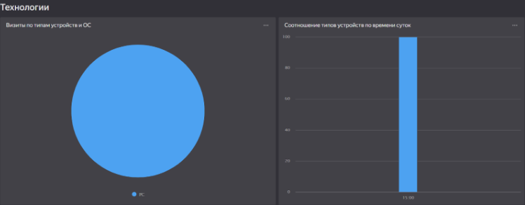

## Лабораторная работа 4. Анализирование сайта с помощью Яндекс.Метрики и Yandex DataLens
> [Отчет по работе](https://drive.google.com/file/d/13-mLQRXsxqPUaNZ-Fltmh6NM5wz6FWqY/view?usp=drive_link)
> 
> [Ссылка на конечный дашборд](https://datalens.yandex.ru/0p3o09mga42wq-superheroes-dashboard)

Задание: Авторизироваться в Yandex DataLens. Создать счетчик в Яндекс.Метрике. Создать подключение к счетчику в Yandex DataLens. Создать стандартный дашборд. Редактировать стандартный дашборд.

Счетчик в Яндекс.Метрике:

Подключение к счетчику:

Стандартный дашборд:

Редактирование чарта "Визиты по типам устройств и ОС":

