## Лабораторная работа 5-6. Анализирование сайта с помощью Яндекс.Метрики и Yandex DataLens
> [Отчет по работе](https://drive.google.com/file/d/1xdy9-rbh_KJQRLjuNAjJAbol6xiumeHS/view?usp=drive_link)
> 
> [Ссылка на конечный дашборд](https://datalens.yandex/d2hz13nt97ja3)

Задание: Авторизироваться в Yandex DataLens. Создать подключение к csv файлу с знаниями о ДТП. Настроить поля датасета. Создать чарты разных видов. Создать дашборд. Добавить чарты и селекторы на него. Подключить дополнительный источник с геослоями регионов и найти спопоб добавить информацию в виде чарта с нового источника на дашборд.

Подключение к csv файлу:⠀⠀⠀⠀⠀⠀⠀⠀⠀⠀⠀⠀⠀⠀⠀⠀⠀⠀⠀⠀⠀⠀⠀⠀⠀⠀⠀⠀⠀⠀⠀⠀⠀⠀⠀⠀
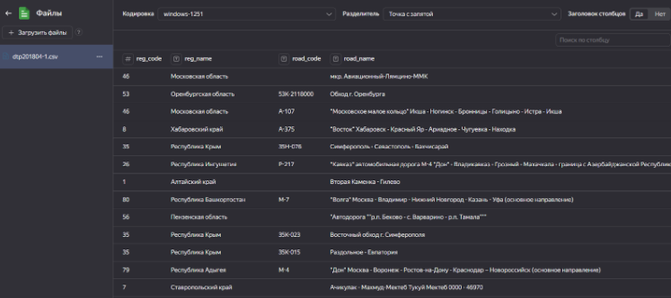

Настройка полей датасета:⠀⠀⠀⠀⠀⠀⠀⠀⠀⠀⠀⠀⠀⠀⠀⠀⠀⠀⠀⠀⠀⠀⠀⠀⠀⠀⠀⠀⠀⠀⠀⠀⠀⠀⠀⠀⠀⠀
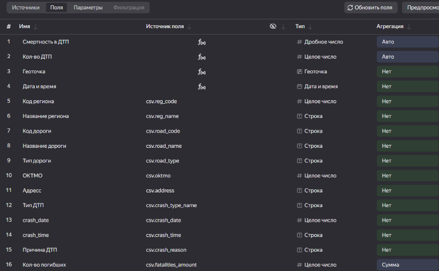

Чарты:
* Тепловая карта⠀⠀⠀⠀⠀⠀⠀⠀⠀⠀⠀⠀⠀⠀⠀⠀⠀⠀⠀⠀⠀⠀⠀⠀⠀⠀⠀⠀⠀⠀⠀⠀⠀⠀⠀⠀⠀⠀⠀⠀⠀⠀⠀⠀⠀⠀⠀
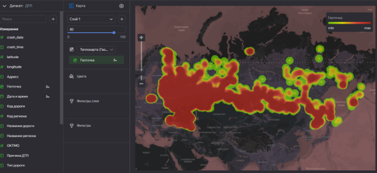
* Линейчатые диаграммы⠀⠀⠀⠀⠀⠀⠀⠀⠀⠀⠀⠀⠀⠀⠀⠀⠀⠀⠀⠀⠀⠀⠀⠀⠀⠀⠀⠀⠀⠀⠀⠀⠀⠀⠀⠀
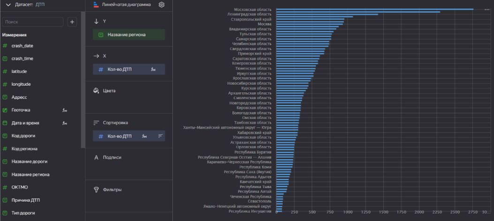
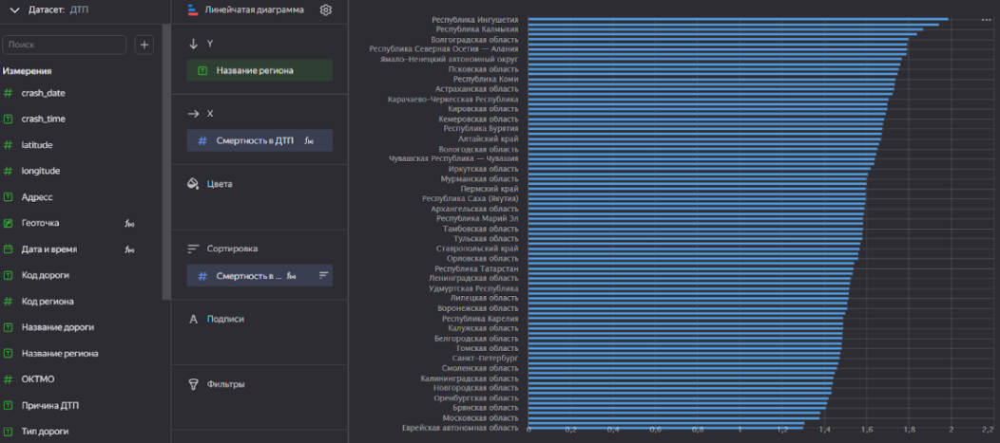
* Линейные диаграммы⠀⠀⠀⠀⠀⠀⠀⠀⠀⠀⠀⠀⠀⠀⠀⠀⠀⠀⠀⠀⠀⠀⠀⠀⠀⠀⠀⠀⠀⠀⠀⠀⠀⠀⠀⠀⠀⠀
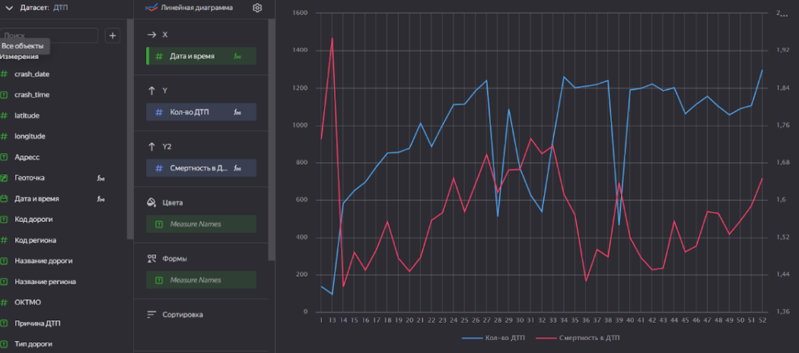
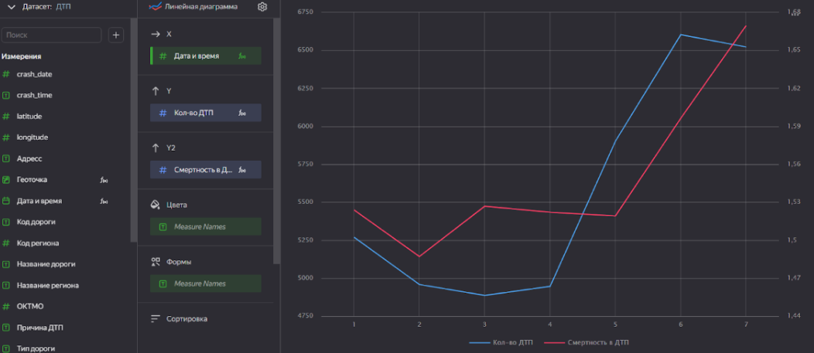
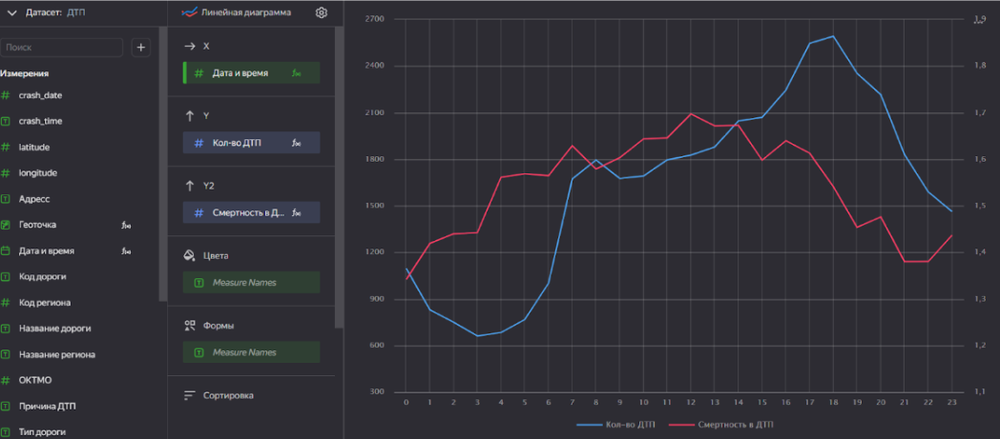

Дашборд с добавленными чартами и селекторами:
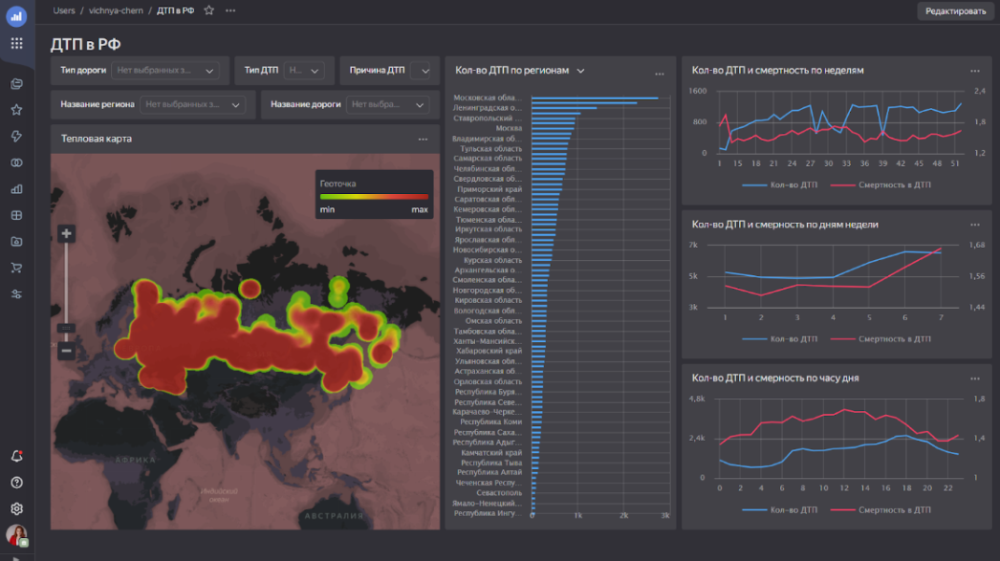

Подключение дополнительного источника с геослоями регионов:
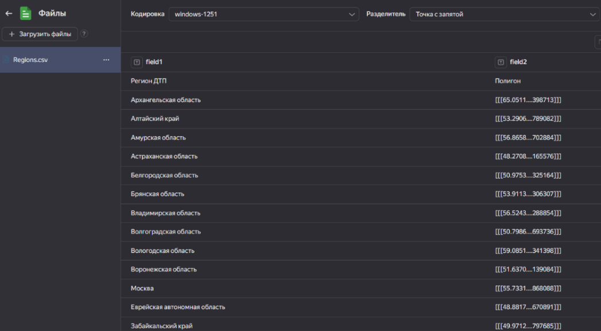

Нельзя объединить данные из разных источников на уровне одного датасета. Поэтому создаем новый датасет из дополнительного источника:
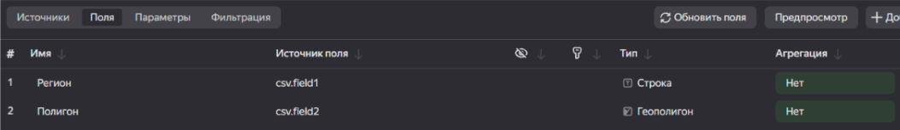

Создание чарта, благодаря объединению данных из разных источников на уровне чарта:
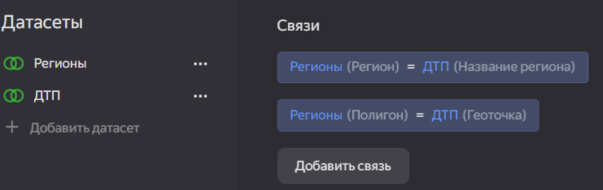
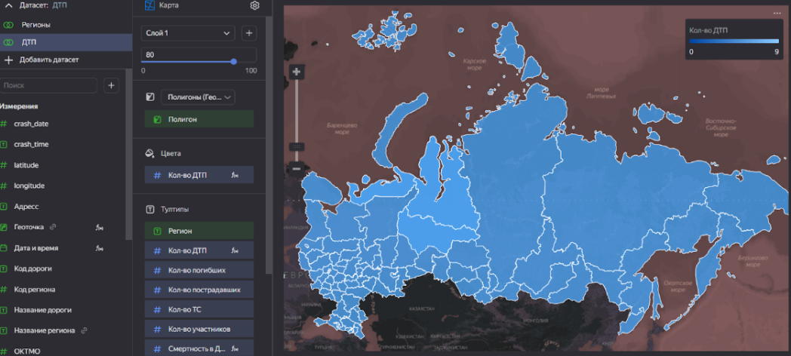

Добавление нового чарта на дэшборд, как выборочный из 2-ух чартов:
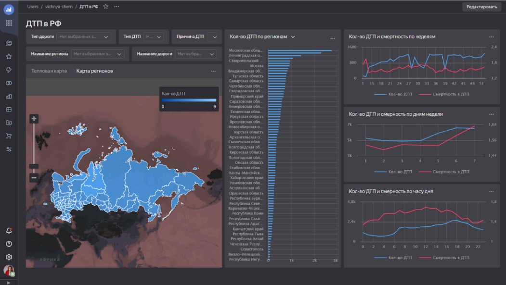
